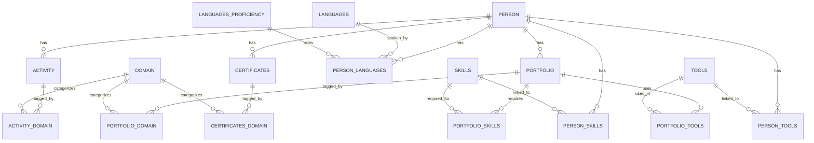

# Database Schema

PostgreSQL database with 15 normalized tables (9 entities + 6 junctions).

---

## Entity Relationship Diagram

---

## Core Tables

| Table | Purpose |
|-------|---------|
| PERSON | Profile (1 record) |
| ACTIVITY | Timeline entries (jobs, projects, milestones) |
| PORTFOLIO | Showcased projects |
| CERTIFICATES | Credentials and learning |
| SKILLS | Competency master list |
| TOOLS | Technology master list |
| LANGUAGES | Languages master list |
| DOMAIN | Thematic categories (Climate, Data, Biology, etc.) |
| LANGUAGES_PROFICIENCY | Proficiency levels (Native, Fluent, Professional, Basic) |

---

## Junction Tables

| Table | Purpose |
|-------|---------|
| ACTIVITY_DOMAIN | Links activities to domains |
| PORTFOLIO_DOMAIN | Links projects to domains |
| PORTFOLIO_SKILLS | Links projects to required skills |
| PORTFOLIO_TOOLS | Links projects to used tools |
| CERTIFICATES_DOMAIN | Links credentials to domains |
| PERSON_SKILLS | Links person to skills (with proficiency level 1-5) |
| PERSON_TOOLS | Links person to tools (with proficiency level 1-5) |
| PERSON_LANGUAGES | Links person to languages (with proficiency) |

---

## Key Relationships

- One PERSON has many ACTIVITY, PORTFOLIO, CERTIFICATES
- Many-to-many relationships via junction tables
- All competencies (skills, tools, languages) have proficiency levels
- Domains connect experiences, projects, and credentials for thematic filtering
